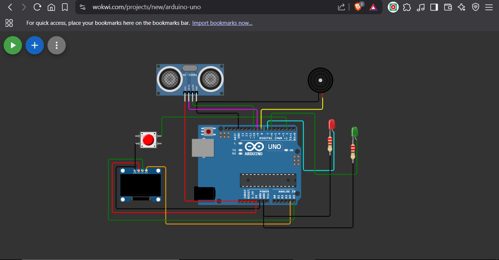

# 🚁 Drone Obstacle Detection Simulator

This Arduino-based project simulates a drone detecting obstacles using an HC-SR04 ultrasonic sensor. Visual and audio feedback is provided via LEDs, a buzzer, and an OLED display. It also includes a push button to toggle the system on/off.

🎯 Goal:
Simulate a drone detecting nearby obstacles using ultrasonic sensors and reacting by printing actions like "Obstacle Ahead – Ascend" or "Path Clear" to the Serial Monitor.

Platform: Wokwi Simulator

DroneObstacleSimulator/
│
├── Drone_Obstacle_Simulation.ino   ← Arduino code
├── README.md
└── screenshots/
    └── CKT.png

## 🔧 Features
- Distance measurement via ultrasonic sensor
- OLED display with live distance output
- Red/Green LED indicators
- Buzzer warning for close obstacles
- Push button to start/stop detection

## 📷 Circuit Diagram

## 🧠 Components Used
- Arduino Uno
- HC-SR04 Ultrasonic Sensor
- SSD1306 OLED Display
- Red & Green LEDs
- Buzzer
- Push Button
- Resistors (220Ω)

## 🖥️ Serial Monitor Output
Distance: 34.78 cm
✅ Path Clear
Distance: 16.54 cm
⚠️ Obstacle Ahead!

## 💻 Simulation
Try it online: [https://wokwi.com/projects/434637932191287297](#)

